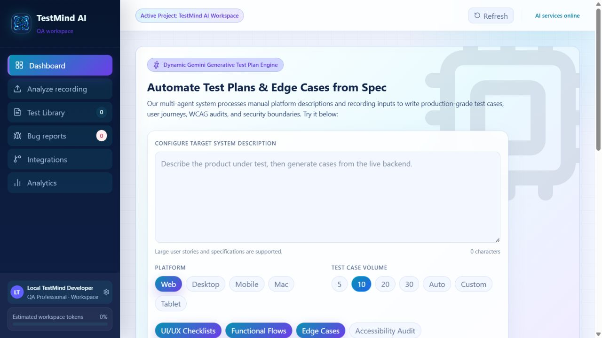
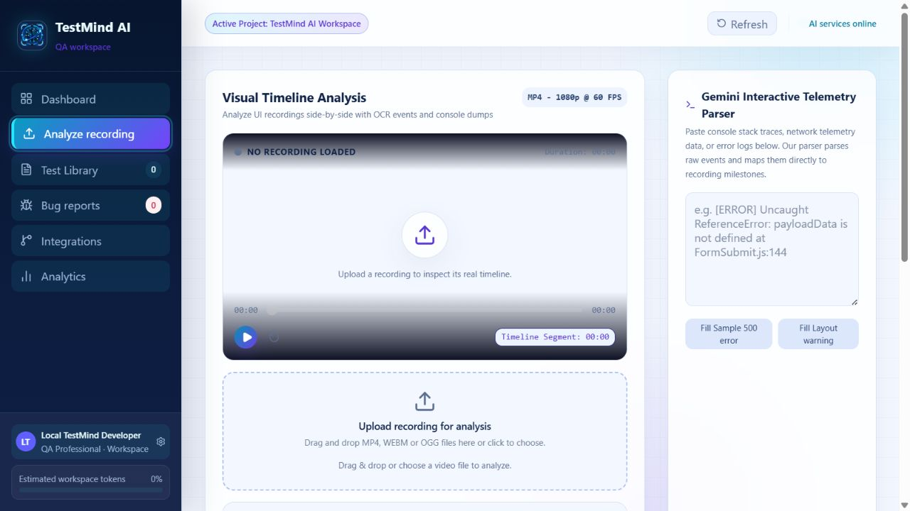

# TestMind AI

[](https://github.com/abdullah9558/TestMindAI/actions/workflows/ci.yml)
[](LICENSE)
[](package.json)

<p align="center">
  
</p>

TestMind AI is an AI-assisted quality engineering workspace for turning user stories, product descriptions, telemetry, and screen recordings into structured test coverage. It combines test-case generation, test management, automation starter scripts, bug tracking, user profiles, and GitHub publishing in one responsive web application.

The project is currently a functional full-stack MVP. It is suitable for local development, demonstrations, and controlled pilot use. Review the [Current limitations](#current-limitations-and-production-gaps) section before treating it as a production deployment.



<details>
  <summary>View recording-analysis workspace</summary>
  <br />
  
</details>

## Why TestMind AI?

Traditional QA planning is slow to maintain across long user stories, visual workflows, automation frameworks, and engineering tools. TestMind AI keeps those activities connected: one requirement or recording can become understandable test coverage, editable automation starters, execution status, bug reports, and version-controlled GitHub assets.

## Contents

- [Core capabilities](#core-capabilities)
- [How the system works](#how-the-system-works)
- [Technology stack](#technology-stack)
- [Repository structure](#repository-structure)
- [Prerequisites](#prerequisites)
- [Installation](#installation)
- [Configuration](#configuration)
- [Database setup](#database-setup)
- [AI provider setup](#ai-provider-setup)
- [GitHub OAuth setup](#github-oauth-setup)
- [Running the application](#running-the-application)
- [Building for production](#building-for-production)
- [API overview](#api-overview)
- [Automation output](#automation-output)
- [Current limitations](#current-limitations-and-production-gaps)
- [Troubleshooting](#troubleshooting)

## Core capabilities

### AI test-case generation

- Generates test cases from user stories and product descriptions.
- Supports configurable platforms, test volume, and testing perspectives.
- Uses Groq for suitable text requests and falls back to Gemini when configured.
- Routes large specifications to Gemini to avoid Groq token-per-minute limits.
- Produces simple test titles beginning with **“Verify that”**.
- Persists generated cases in PostgreSQL.

### Recording analysis

- Uploads MP4, WebM, OGG, MOV, and AVI recordings.
- Uses Gemini multimodal analysis to extract timestamped observations.
- Generates evidence-based test cases after the user explicitly selects **Generate Test Cases**.
- Attempts to ground video-derived cases in visible actions, controls, states, and timestamps.

### Test library and automation

- Displays test cases in a compact, collapsible library.
- Supports Pending, Passed, Failed, and Blocked execution states.
- Generates automation starter suites for Playwright, Cypress, and Selenium.
- Exposes readable locator keys so users know which selectors must be supplied.
- Allows automation content to be viewed and copied from the Test Library.

### GitHub integration

- Connects a real GitHub account through OAuth.
- Reads the connected user and repository information.
- Creates repositories through the GitHub API.
- Publishes test cases, locator maps, automation suites, documentation, and a validation workflow.
- Creates branches and pull requests for generated QA assets.
- Pushes bug reports to GitHub Issues.
- Supports disconnecting and revoking the GitHub grant.

### Project management

- Stores projects, user preferences, test cases, recordings, and bug reports.
- Includes a lightweight profile page for defaults such as platform and testing perspectives.
- Provides dashboard and analytics summaries based on persisted workspace data.
- Includes Gemini-backed telemetry parsing for console, layout, and network diagnostics.

## How the system works

```text
React/Vite client (5173)
        |
        | JSON API + JWT
        v
Express/TypeScript API (5000)
   |         |          |
   |         |          +--> GitHub OAuth and REST API
   |         +-------------> Groq and Gemini APIs
   +-----------------------> PostgreSQL
   |
   +-----------------------> Local server/uploads directory
```

1. In development, the frontend requests a local development session and receives a JWT.
2. The backend creates or loads the current user and workspace data from PostgreSQL.
3. A user submits a story or uploads a recording.
4. Text generation is routed between Groq and Gemini according to input size and availability. Video and telemetry analysis require Gemini.
5. Generated test cases are normalized and stored in PostgreSQL.
6. Automation previews are generated from each case using editable locator keys.
7. When GitHub is connected, the backend can publish the generated QA assets to a selected repository.

## Technology stack

| Layer | Technology |
|---|---|
| Frontend | React 19, TypeScript, Vite 8 |
| Styling | Tailwind CSS 4 via `@tailwindcss/vite` |
| Icons | Lucide React |
| Backend | Node.js, Express 4, TypeScript |
| Database | PostgreSQL with `pg` |
| Authentication | JWT and GitHub OAuth |
| AI | Groq SDK and Google Gemini REST API |
| Uploads | Multer with local disk storage |
| Integrations | GitHub REST API through Axios |

## Repository structure

```text
TestMindAI/
├── public/                      Static assets and the current logo
├── src/
│   ├── api/                     Frontend API clients
│   ├── App.tsx                  Main application UI and state
│   ├── index.css                Global theme and responsive styling
│   └── main.tsx                 React entry point
├── server/
│   ├── src/
│   │   ├── controllers/         Request handlers
│   │   ├── db/                  PostgreSQL connection and schema initialization
│   │   ├── middleware/          JWT, error, and upload middleware
│   │   ├── routes/              Express API routes
│   │   ├── services/            AI, GitHub, auth, and automation services
│   │   └── index.ts             API entry point
│   ├── uploads/                 Local uploaded recordings; created automatically
│   └── package.json             Backend dependencies and commands
├── package.json                 Frontend dependencies and commands
├── vite.config.ts               Vite and GitHub Pages base configuration
└── README.md
```

## Prerequisites

Install the following before setting up the project:

- **Node.js 22 LTS or newer.** Vite 8 requires Node `20.19+` or `22.12+`; Node 21 is not supported.
- **npm**, included with Node.js.
- **PostgreSQL 14 or newer** and PostgreSQL command-line tools, or a client such as DBeaver.
- A **Groq API key**, a **Gemini API key**, or both.
- A **GitHub account** and OAuth App if GitHub integration is required.
- Git for cloning and contributing.

Verify the installed tools:

```bash
node --version
npm --version
git --version
psql --version
```

## Installation

### 1. Clone the repository

```bash
git clone https://github.com/abdullah9558/TestMindAI.git
cd TestMindAI
```

### 2. Install frontend dependencies

```bash
npm install
```

### 3. Install backend dependencies

```bash
cd server
npm install
cd ..
```

The combined development runner is included in the root development dependencies.

## Configuration

### Backend environment

Create `server/.env`. Never commit this file.

```dotenv
# Server
PORT=5000
NODE_ENV=development
FRONTEND_URL=http://localhost:5173

# PostgreSQL
DB_HOST=127.0.0.1
DB_PORT=5432
DB_USER=testmind_app
DB_PASSWORD=replace_with_a_strong_password
DB_NAME=testmind_ai

# Authentication
JWT_SECRET=replace_with_a_long_random_secret
JWT_EXPIRES_IN=7d
TOKEN_ENCRYPTION_KEY=replace_with_another_long_random_secret

# AI providers
GROQ_API_KEY=
GROQ_MODEL=openai/gpt-oss-120b
GEMINI_API_KEY=
GEMINI_MODEL=gemini-3.6-flash
GEMINI_VIDEO_MODEL=gemini-3.6-flash
AI_REQUEST_TIMEOUT_MS=240000

# GitHub OAuth
GITHUB_CLIENT_ID=
GITHUB_CLIENT_SECRET=
GITHUB_REDIRECT_URI=http://localhost:5000/api/integrations/github/callback

# Upload limit in bytes; approximately 95 MB
MAX_FILE_SIZE=95000000
API_RATE_LIMIT=300
AI_RATE_LIMIT=30
```

Generate a strong JWT secret with Node:

```bash
node -e "console.log(require('crypto').randomBytes(48).toString('hex'))"
```

### Frontend environment

The frontend defaults to `http://127.0.0.1:5000/api`. To configure another backend, create `.env.local` in the repository root:

```dotenv
VITE_API_URL=http://127.0.0.1:5000/api
```

Restart Vite after changing frontend environment values.

## Database setup

The backend initializes tables and indexes automatically when it starts. You must create the PostgreSQL role and database first.

Open `psql` as a PostgreSQL administrator and run:

```sql
CREATE ROLE testmind_app WITH LOGIN PASSWORD 'replace_with_a_strong_password';
CREATE DATABASE testmind_ai OWNER testmind_app;
```

Then confirm the values match `server/.env`.

The backend currently creates these tables:

- `users`
- `projects`
- `test_cases`
- `bug_reports`
- `video_recordings`
- `timeline_events`
- `github_repositories`

The schema is initialized from `server/src/db/schema.ts`. You can also run it explicitly with `npm run migrate --prefix server`.

### DBeaver connection example

| Setting | Example |
|---|---|
| Host | `127.0.0.1` |
| Port | `5432` |
| Database | `testmind_ai` |
| Username | `testmind_app` |
| Password | Value from `DB_PASSWORD` |

Use your own password; do not copy development credentials into a public or production environment.

## AI provider setup

### Groq

1. Create a key at [console.groq.com/keys](https://console.groq.com/keys).
2. Add it to `GROQ_API_KEY`.
3. Set `GROQ_MODEL` to a model available to your Groq account.

Groq is best suited to shorter text requests in the current implementation. Requests that exceed the configured token budget are routed to Gemini when Gemini is available.

### Gemini

1. Create a key through [Google AI Studio](https://aistudio.google.com/app/apikey).
2. Add it to `GEMINI_API_KEY`.
3. Configure `GEMINI_MODEL` and `GEMINI_VIDEO_MODEL` with models enabled for your account.

Gemini is required for:

- Screen-recording analysis
- Telemetry parsing
- Large-input fallback generation

Model availability changes over time. If the configured model returns `404` or “model not found,” replace the model name with one currently available to your Gemini account.

## GitHub OAuth setup

1. Open [GitHub Developer Settings](https://github.com/settings/developers).
2. Select **OAuth Apps** and create a new OAuth App.
3. Use these local values:

   | Field | Value |
   |---|---|
   | Application name | `TestMind AI Local` |
   | Homepage URL | `http://localhost:5173` |
   | Authorization callback URL | `http://localhost:5000/api/integrations/github/callback` |

4. Copy the Client ID into `GITHUB_CLIENT_ID`.
5. Generate a Client Secret and place it in `GITHUB_CLIENT_SECRET`.
6. Set `GITHUB_REDIRECT_URI` to the exact callback URL registered above.
7. Restart the backend.

The integration requests repository, workflow, user, and email scopes. Treat GitHub access tokens as sensitive credentials.

## Running the application

### Recommended: two terminals

Backend:

```bash
cd server
npm run dev
```

Frontend, from the repository root:

```bash
npm run dev -- --host 0.0.0.0
```

Open:

- Application: [http://localhost:5173/TestMindAI/](http://localhost:5173/TestMindAI/)
- Backend health check: [http://localhost:5000/health](http://localhost:5000/health)

The `/TestMindAI/` path comes from the Vite `base` setting used for GitHub Pages.

### Combined command

The repository includes `concurrently`, so both services can be started with:

```bash
npm run dev:full
```

### Access from another device

Start Vite with `--host 0.0.0.0`, set `FRONTEND_URL` and `VITE_API_URL` to addresses reachable from that device, and ensure the firewall permits ports 5173 and 5000. A local network address only works while both devices can reach the same computer. For internet access, deploy the application or use a secure development tunnel.

## Available commands

### Frontend/root

| Command | Purpose |
|---|---|
| `npm run dev` | Start Vite development server |
| `npm run dev:server` | Start the backend from the root |
| `npm run dev:full` | Start both services |
| `npm run build` | Type-check and build the frontend |
| `npm run build:server` | Build the backend |
| `npm run lint` | Run frontend ESLint checks |
| `npm test` | Run backend unit tests |
| `npm run check` | Run lint, tests, and both builds |
| `npm run preview` | Preview the frontend production build |
| `npm run deploy` | Publish `dist` through `gh-pages` |

### Backend

| Command | Purpose |
|---|---|
| `npm run dev` | Run the API with `tsx watch` |
| `npm run build` | Compile TypeScript to `server/dist` |
| `npm start` | Run the compiled backend |
| `npm run migrate` | Initialize or update the current database schema |

## Building for production

Build the frontend:

```bash
npm run build
```

Build the backend:

```bash
npm run build:server
```

Start the compiled backend:

```bash
cd server
npm start
```

The frontend can be deployed as static files from `dist`. The backend and PostgreSQL database must be deployed separately. Before using a host other than GitHub Pages, review the `base: '/TestMindAI/'` value in `vite.config.ts`; many hosts should use `/` instead.

For production, configure:

- A managed PostgreSQL instance
- HTTPS frontend and API URLs
- Production GitHub OAuth URLs
- Secret management rather than plain environment files
- Persistent object storage for uploaded recordings
- Appropriate CORS origins
- Logging, monitoring, backups, and rate limits

## API overview

All protected endpoints expect:

```http
Authorization: Bearer <jwt>
```

### Authentication and profile

| Method | Endpoint | Purpose |
|---|---|---|
| `POST` | `/api/auth/dev-session` | Create a local development session; disabled in production |
| `GET` | `/api/auth/me` | Get the current profile |
| `PUT` | `/api/auth/me` | Update profile and test defaults |

### Projects

| Method | Endpoint | Purpose |
|---|---|---|
| `GET` | `/api/projects` | List projects |
| `POST` | `/api/projects` | Create a project |
| `GET` | `/api/projects/:projectId` | Get one project |
| `PUT` | `/api/projects/:projectId` | Update a project |
| `DELETE` | `/api/projects/:projectId` | Delete a project and related records |

### Test cases

| Method | Endpoint | Purpose |
|---|---|---|
| `POST` | `/api/test-cases/generate` | Generate and persist AI test cases |
| `POST` | `/api/test-cases` | Create a manual test case |
| `GET` | `/api/test-cases/:projectId` | List project test cases |
| `GET` | `/api/test-cases/:testCaseId/automation` | Generate automation preview |
| `PUT` | `/api/test-cases/:testCaseId/status` | Update execution status |
| `DELETE` | `/api/test-cases/:testCaseId` | Delete one test case |
| `DELETE` | `/api/test-cases/project/:projectId` | Clear a project’s test cases |

### Bugs

| Method | Endpoint | Purpose |
|---|---|---|
| `GET` | `/api/bugs/:projectId` | List project bugs |
| `POST` | `/api/bugs` | Create a bug report |
| `PUT` | `/api/bugs/:bugId/status` | Update bug status |

### Integrations

| Method | Endpoint | Purpose |
|---|---|---|
| `POST` | `/api/integrations/:projectId/upload-video` | Upload a recording |
| `POST` | `/api/integrations/parse-telemetry` | Parse diagnostic text with Gemini |
| `GET` | `/api/integrations/github/auth` | Begin GitHub authorization |
| `GET` | `/api/integrations/github/callback` | Complete GitHub authorization |
| `GET` | `/api/integrations/github/status` | Get connected account status |
| `GET` | `/api/integrations/github/repos` | List repositories |
| `POST` | `/api/integrations/github/repos` | Create a repository |
| `POST` | `/api/integrations/github/publish` | Publish QA assets |
| `POST` | `/api/integrations/github/push-bug` | Create a GitHub issue |
| `DELETE` | `/api/integrations/github/connection` | Disconnect GitHub |

## Automation output

Published automation assets use this structure:

```text
testmind/
├── test-cases.json
└── automation/
    ├── locators.json
    ├── package.json
    ├── README.md
    ├── playwright/generated.spec.js
    ├── cypress/e2e/generated.cy.js
    └── selenium/generated.test.js
```

The scripts are genuine framework starter suites, but locator values are intentionally placeholders. Fill in `locators.json` using stable selectors such as `data-testid`, accessible roles, labels, IDs, or carefully chosen CSS selectors before executing the suites.

Install dependencies inside the generated `testmind/automation` directory:

```bash
npm install
npx playwright install
```

Then run one framework:

```bash
npm run test:playwright
npm run test:cypress
npm run test:selenium
```

Selenium also requires a compatible browser installation. Modern Selenium Manager normally resolves the matching driver automatically.

## Current limitations and production gaps

The following production work remains:

1. **Limited automated coverage.** Initial automation-generation unit tests and CI are included, but broader API, database, UI, and end-to-end coverage is still needed.
2. **Local upload storage.** Recordings are saved under `server/uploads`; they will be lost on ephemeral hosting and are not suitable for multi-instance deployment.
3. **Synchronous video processing.** Videos are read and sent inline to Gemini. Production should use object storage, queues, background workers, and progress tracking.
4. **AI output is probabilistic.** Generated tests require human review. Video grounding reduces invention but cannot guarantee perfect interpretation.
5. **Automation locators require user input.** Generated scripts cannot run against an unknown product until the locator map and target URL are completed.
6. **Token encryption requires configuration.** Set `TOKEN_ENCRYPTION_KEY` in production; a dedicated secret vault remains preferable for larger deployments.
7. **Development authentication is not production authentication.** The dev-session endpoint is disabled in production; production requires GitHub OAuth or another complete sign-in system.
8. **No background job queue.** Rate limits protect expensive endpoints, but durable queueing and retry management are still needed.
9. **Deployment is split.** `gh-pages` deploys only the frontend and does not deploy Express, PostgreSQL, uploads, or secrets.
10. **Provider model names can expire.** Update Groq and Gemini model values as provider availability changes.

## Troubleshooting

### Vite fails with a Node version error

Install Node 22 LTS. Do not use Node 21 with this Vite release.

```bash
node --version
```

### `concurrently` is not recognized

```bash
npm run dev:full
```

If the command is unavailable, run `npm install` from the repository root. You can also run the frontend and backend in separate terminals.

### Backend reports `ECONNREFUSED`

- Confirm PostgreSQL is running.
- Confirm `DB_HOST` and `DB_PORT` match the active PostgreSQL listener.
- The default PostgreSQL port is `5432`; do not use `5433` unless your server actually listens there.

Windows check:

```powershell
Get-Service *postgres*
netstat -ano | Select-String ':5432'
```

### Password authentication failed

Test the same credentials directly:

```bash
psql -h 127.0.0.1 -p 5432 -U testmind_app -d testmind_ai
```

Update either PostgreSQL or `server/.env` so the passwords match.

### Frontend displays “Failed to fetch”

1. Open `http://localhost:5000/health` and confirm it returns `status: OK`.
2. Confirm `VITE_API_URL` points to the backend `/api` path.
3. Confirm `FRONTEND_URL` matches the exact frontend origin allowed by CORS.
4. Restart both services after environment changes.
5. Check firewall and network accessibility when using another device.

### AI generation fails or times out

- Confirm at least one AI key is configured.
- Gemini is mandatory for video and telemetry flows.
- Increase `AI_REQUEST_TIMEOUT_MS` for large text generation when appropriate.
- Reduce very large input or recording size.
- Check provider quotas, model access, billing, and rate limits.
- A Groq `413` TPM response means the request exceeds the account/model token allowance; configure Gemini fallback or use a smaller request.

### GitHub OAuth reports “not configured”

- Confirm Client ID, Client Secret, and redirect URI are present.
- Ensure the callback URL matches GitHub exactly, including protocol, port, and path.
- Restart the backend after updating secrets.

### GitHub publish returns `404 Not Found`

- Reconnect GitHub to obtain a current token.
- Confirm the requested OAuth scopes include repository and workflow access.
- Confirm the repository exists and the authenticated account can write to it.
- Confirm the selected base branch exists.
- For organization repositories, check organization OAuth restrictions and SSO authorization.

## Security notes

- Never commit `.env`, OAuth secrets, database passwords, JWT secrets, or API keys.
- Rotate any secret that has been exposed in logs, screenshots, chat, or source control.
- Use separate credentials for development and production.
- Restrict CORS to trusted production origins.
- Validate uploaded content independently of browser-provided MIME types.
- Add rate limiting, audit logs, malware scanning, token encryption, and retention policies before public use.

## Contributing

1. Create a branch from `main`.
2. Keep changes focused and avoid committing local secrets or uploads.
3. Run frontend and backend builds.
4. Test the affected workflow manually until automated coverage is added.
5. Open a pull request describing the change, impact, and validation performed.

```bash
npm run build
npm run build:server
```

## License

Licensed under the [MIT License](LICENSE).
